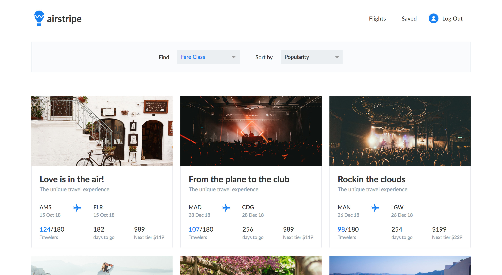

## **Design credit of the project: [Mário Rodrigues](https://dribbble.com/shots/4011619-Airstripe-Web-App/attachments/923310)**

## Airstripe

> Airstripe is a demo app for crowdfunding flights. It is an interactive CRUD app using React for UI, Redux for global state management, Firebase for authentication and data API.

### Demo

https://airstripe-dev.firebaseapp.com



## Stack

* [React](https://github.com/facebook/react)
* [React Router](https://github.com/ReactTraining/react-router)
* [Redux](https://github.com/reactjs/redux)
* [Redux Thunk](https://github.com/gaearon/redux-thunk)
* [Firebase](https://firebase.google.com/)

### Quick Start

**Clone the project**

```shell
$ git clone https://github.com/trunglive/airstripe.git
```

**Run the app**

```shell
$ cd airstripe
$ yarn install
$ yarn start
```

### Contributor

Trung Vo ([trunglive](https://github.com/trunglive))

### License

This project is licensed under the MIT License. Please check the `LICENSE` file.
